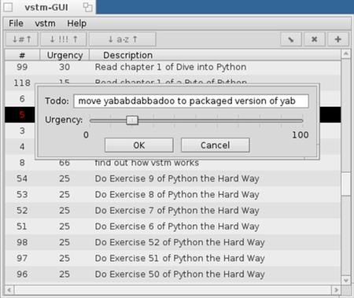

# vstm GUI

Simple TODO list manager for Haiku with graphical front-end

vstm utility (bundled) by Frank Villaro-Dixon - 2012 - beerware

GUI by Michel Clasquin-Johnson. Public Domain software written in yab using the Yabadabbadoo IDE

Get it here: https://github.com/clasqm/vstm-gui
